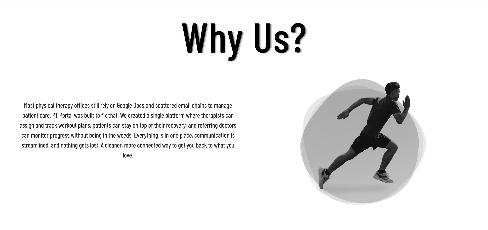
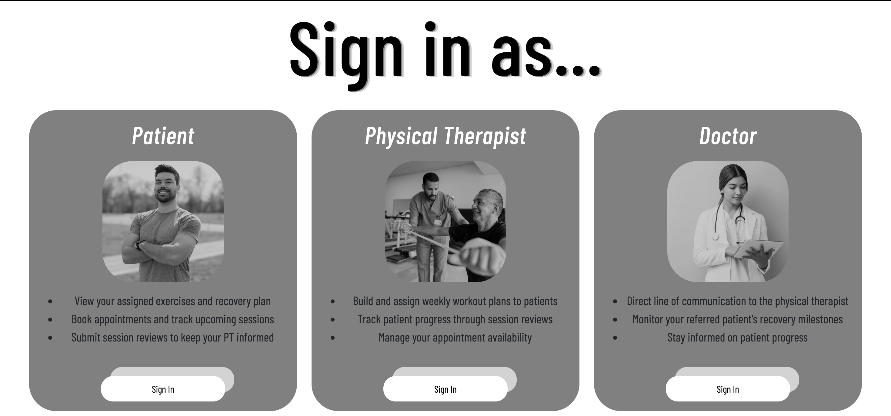
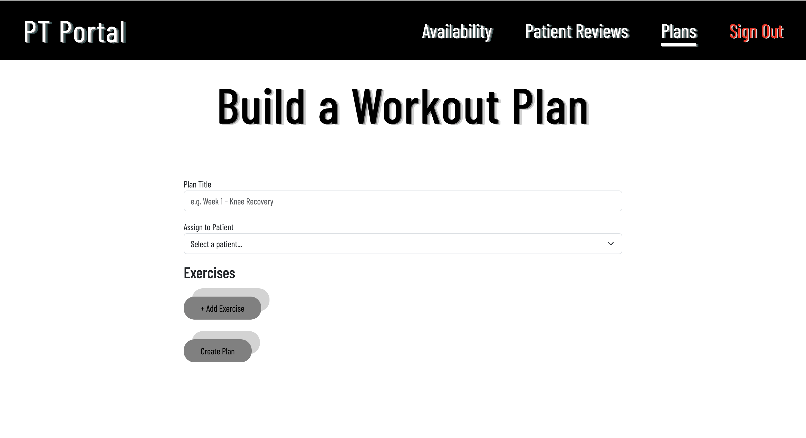
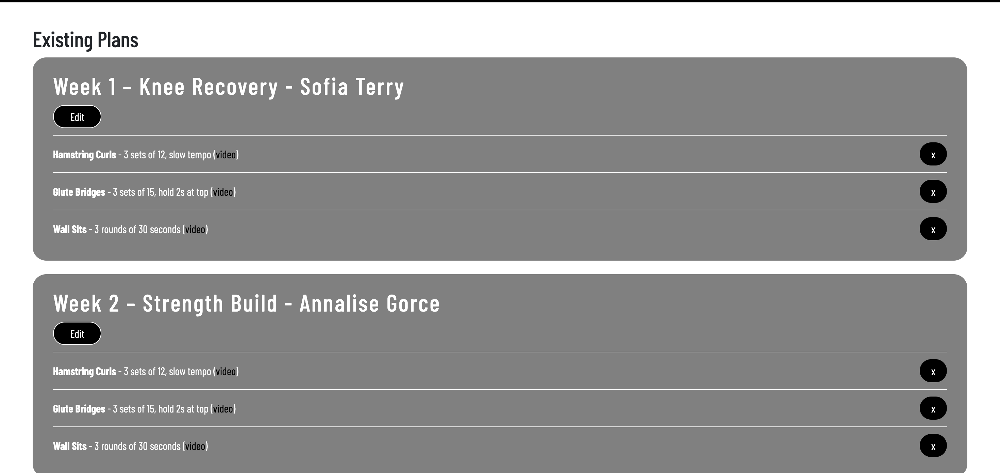
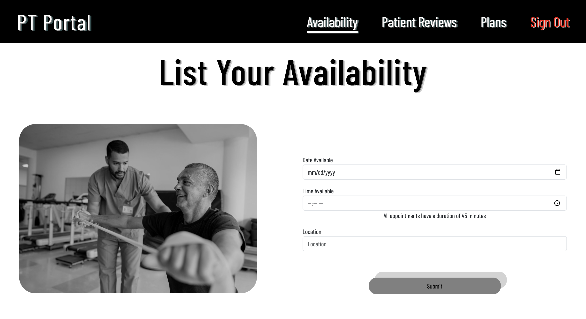
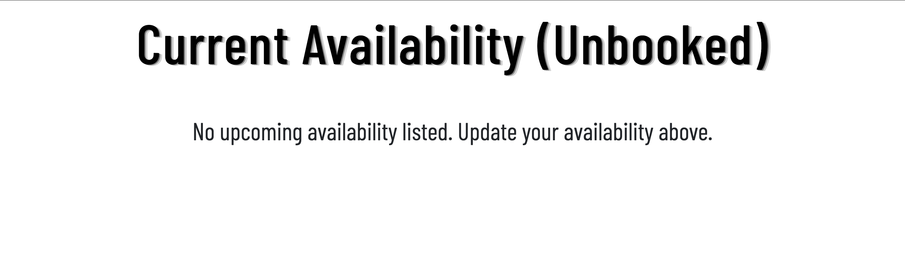
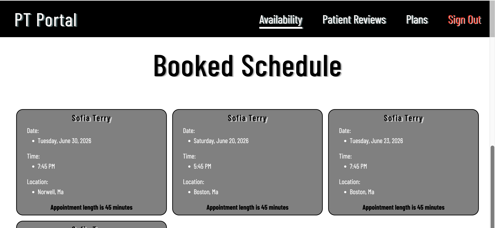
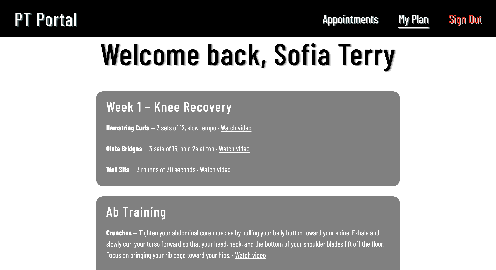
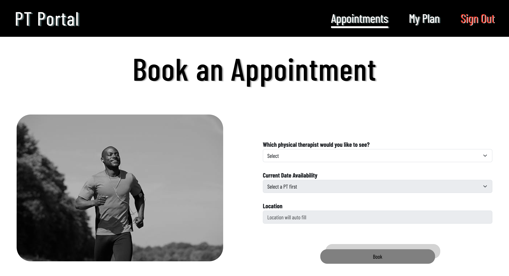

# PT Portal

PT Portal is a web application that replaces the Google Docs and email workflow used by physical therapy offices. Physical therapists build and assign workout plans, patients book appointments and submit session reviews, and referring doctors get a read-only view of patient milestones. The app supports three roles — **PT**, **Patient**, and **Doctor** — selectable from the sign-in page.

## Demo Video

[Watch the demo on YouTube](https://youtu.be/aT5Ky-WPlhw)

## Authors

- **Sean Behan**
- **Julian Leonhardt**

## Class

CS5610 Web Development — Northeastern University.

https://johnguerra.co/classes/webDevelopment_online_summer_2026/

## Project Objective

Physical therapy offices often manage patient care through scattered Google Docs and email chains. PT Portal brings it all into one place: therapists can create and assign workout plans with video guidance, patients can stay on top of their recovery and book their own appointments, and referring doctors can monitor progress without being involved day to day.

## Features

**Physical Therapist**

- Build workout plans with exercises (name, description, video link) and assign them to a patient
- Edit existing plans and remove individual exercises
- Set open appointment availability and view booked sessions
- Read patient session reviews and log recovery milestones

**Patient**

- View their assigned workout plan with exercise details and video links
- Book an appointment from the PT's open availability
- Submit session reviews after each visit

**Doctor**

- Read-only view of milestones the PT has logged for their referred patient

## How appointments, milestones, and reviews connect

These three pieces are what tie the roles together, so here is how a typical patient moves through the app.

**Appointments** start with the physical therapist. A PT posts open availability, which creates an unbooked appointment with a date, time, and location but no patient attached yet. A patient browses a PT's open slots and books one, which flips the appointment to booked and stamps it with the patient and the doctor who referred them. From then on the same appointment shows up in three places: the PT's schedule, the patient's upcoming appointments, and the doctor's list of referred patients.

**Reviews** flow from the patient back to the PT. After a session the patient writes a short review with a rating, and it gets attached to that patient. The PT sees every review left by the patients on their schedule, which gives them feedback on how exercises and sessions are landing.

**Milestones** flow from the PT to the doctor. As a patient makes progress the PT logs short recovery notes against that patient. The referring doctor opens their view and sees the patients they sent over along with the milestones logged for each one, so they can follow recovery without being involved day to day.

A patient is the shared thread through all three. A booked appointment links a patient to both a PT and a referring doctor, the patient's reviews surface to that PT, and the milestones that PT logs surface to that doctor.

## Limitations

PT Portal uses mocked authentication rather than real accounts and passwords. There is no real login flow. Instead, each of the three roles is tied to one fixed demo user, and picking a role on the sign-in page signs you in as that user for the session. The three users are:

- **Patient:** Sofia Terry
- **Physical Therapist:** Dr. Sarah Nikki
- **Doctor:** Dr. Kaminski

Because of this, the app always shows the data that belongs to those three users. The PT pages show Dr. Sarah Nikki's schedule and the reviews from her patients, the patient pages show Sofia Terry's plans and appointments, and the doctor page shows the milestones for the patients Dr. Kaminski referred. Switching roles changes which of these three users you are acting as, but you cannot register or sign in as anyone else. These personas are defined in one place, `MOCK_PERSONAS` in `db/users-db.js`.

That said, you will also see data tied to other physical therapists, doctors, and patients that the `npm run seed:data` script injects. This extra data exists so the three signed-in users have a fuller, more realistic experience. For example, the patient can choose from several physical therapists when booking, and the PT's booked patients come with real referring doctors and reviews instead of an empty app.

## Tech Stack

- **Runtime / Server:** Node.js + Express (ES modules)
- **Database:** MongoDB (native MongoDB Node.js driver — no Mongoose)
- **Frontend:** Vanilla ES6, client-side rendering only (no server-side rendering, no template engines)
- **Styling:** CSS organized into per-page modules + Bootstrap 5.3
- **Tooling:** ESLint + Prettier

## Screenshots

### Home & Sign In





### Physical Therapist — Workout Plan Builder




### Physical Therapist — Availability & Schedule





### Patient




## Getting Started

### Prerequisites

- [Node.js](https://nodejs.org/) (v18+)
- A MongoDB database — a free [MongoDB Atlas](https://www.mongodb.com/atlas) cluster works well

### 1. Clone and install

```bash
git clone https://github.com/swbehan/PT-Portal.git
cd PT-Portal
npm install
```

### 2. Configure environment variables

Create a `.env` file in the project root (it is gitignored — never commit it):

```
MONGO_URI=your-mongodb-connection-string
PORT=3000
```

See `.env.example` for the required keys.

### 3. (Optional) Seed sample data

Populate the `workouts` collection with sample plans linked to real patients:

```bash
npm run seed
```

Populate the appointment flow with mock physical therapists, doctors, booked and open appointments, milestones, and reviews:

```bash
npm run seed:data
```

This second script leaves the existing patients untouched and adds data on top, including a connected set for the three demo personas so every role has something to look at right away.

### 4. Run the app

```bash
npm run dev     # development (auto-restart on changes via nodemon)
# or
npm start       # production
```

Then open **http://localhost:3000** in your browser.

## Usage

Because the app signs you in as one of three fixed users (see [Limitations](#limitations)), the data only lines up across roles if you post and book against the matching hardcoded user. Keep this in mind as you click around:

- **Plans:** When you are the PT, assign a workout plan to **Sofia Terry** if you want the Patient view to show it. The patient page only loads plans assigned to Sofia.
- **Appointments:** As the Patient, book a slot from **Dr. Sarah Nikki's** open availability. A slot from one of the seeded PTs will not appear on the PT page, since that page only shows Dr. Sarah Nikki's schedule. Every appointment you book is automatically referred by **Dr. Kaminski**.
- **Reviews:** Reviews are posted as the Patient (Sofia Terry) and show up on the PT's patient-review page once Sofia is booked with Dr. Sarah Nikki.
- **Milestones:** As the PT, log milestones for one of your booked patients. The Doctor view (Dr. Kaminski) then shows those milestones for the patients he referred.

A quick end-to-end run that touches all three roles:

1. Sign in as the **PT**, post an open availability slot, and assign a workout plan to Sofia Terry.
2. Sign in as the **Patient** (Sofia Terry), book that slot, view the assigned plan, and submit a review.
3. Back as the **PT**, read Sofia's review and log a milestone for her.
4. Sign in as the **Doctor** (Dr. Kaminski) to see that milestone under your referred patients.

That being said, the database still updates every document and collection correctly no matter which user you act against. The writes always succeed; the UI just will not surface them when they are tied to a user other than the three hardcoded ones. This is a known limitation that we hope to fix in the future by adding real per-user accounts.

## Deployment

<!-- TODO: add the public deployment URL once the app is hosted -->

_Deployment URL: TBD_

## Project Structure

```
db/        MongoDB connection + per-collection data modules
routes/    Express routers (appointments, workouts, users, reviews, milestones)
frontend/  Client-side pages, JS, and CSS modules
scripts/   One-off utilities (e.g. database seeding)
screenshots/ Screenshots of the application to supply the readme
server.js  Express app entry point
```

## AI Usage

Julian:

I used an AI coding assistant (Claude Code) during development, primarily as a guided tutor and code reviewer rather than to generate the project wholesale. Specifically, it was used to:

- Explain concepts and recommend approaches before I wrote code
- Review my code and help diagnose bugs (syntax errors, data-model mismatches, fetch issues)
- Generate some boilerplate and repetitive scaffolding, which I then reviewed and adapted
- Help write the database seed script and this README

All code was reviewed and understood by me, and the architectural decisions were all mine.

Sean:

I used an AI coding assistant (Claude Code) to build the database seeding script that fills the app with mock data. It read the existing collections to match the document shapes, generated the physical therapists, doctors, appointments, milestones, and reviews, and wired up a connected set of data for the three demo personas so each role has something to look at on first run. I reviewed the script and the data it produced to make sure it lined up with how the app actually works. All decisons about structure regarding the script were done by me.

## License

This project is licensed under the [MIT License](./LICENSE).
